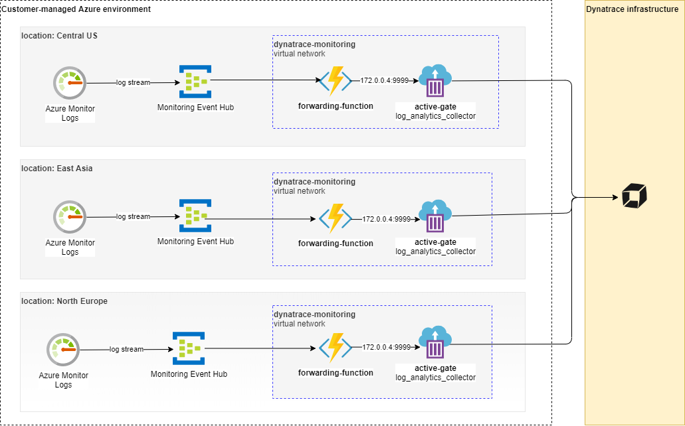

# Dynatrace Azure Log Forwarder
## Overview
This project provides a mechanism that allows streaming Azure logs from Azure Event Hub into Dynatrace Logs via Azure Function App. 
It supports both: Azure Resource Logs and Azure Activity Logs.

Prerequisites:
* Azure CLI - if you run deployment script from your machine (not needed when using Azure Portal Cloud Shell) [https://docs.microsoft.com/en-us/cli/azure/install-azure-cli](https://docs.microsoft.com/en-us/cli/azure/install-azure-cli)
* running Azure Event Hub(s) instance(s) in each Azure location you want to pull logs from 
* configured `diagnostic settings` for resources you would like to stream logs from, pointing to Even Hub(s) (reference [https://docs.microsoft.com/en-us/azure/azure-monitor/essentials/diagnostic-settings](https://docs.microsoft.com/en-us/azure/azure-monitor/essentials/diagnostic-settings))


*Architecture*

azure-log-forwarder-function is an Azure Function App written in Python that pulls logs for configured services. The Function execution is triggered by Azure Event Hub. Once all log records are processed, they are pushed to Dynatrace Logs API.   

`azure-log-forwarder` (with containerized ActiveGate)  components:
* `azure-log-forwarder-function` - function app that subscribes to one Event Hub which is in the same location where you deploy azure-log-forwarder; deployment with App Service Plan and minimum `S1 Standard` pricing tier 
* `azure-log-forwarder-container` - container instances that provides Dynatrace ActiveGate proxy to Dynatrace Infrastructure. This is Azure Container Instance with 1 core, 1.5 GB ram assigned
* `azure-log-forwarder-vnet` - virtual network to ensure private communication between function and active-gate

You need to deploy azure-log-forwarder in each region you want to pull logs from.




# Deployment
Please refer to the instructions:  
   [Dynatrace log forwarder Documentation](https://www.dynatrace.com/support/help/shortlink/azure-log-fwd)

# Viewing Azure logs in Dynatrace UI
 Please [refer to documentation](https://www.dynatrace.com/support/help/shortlink/azure-log-fwd#view-azure-logs).

# Self-monitoring

### Self-monitoring metrics
Please [refer to documentation](https://www.dynatrace.com/support/help/shortlink/azure-log-fwd#self-monitoring-optional).

#### Azure Authentication
Managed identity from Azure Active Directory (AD) is used to authenticate to Azure. It allows an app to easily access other Azure AD-protected resources.

To use Managed identity for Function App, after deployment of azure-log-forwarder is finished you need to add a system-assigned identity. 
In the portal you need to go to Settings section of Function App and select Identity. Within the System assigned tab, switch Status to On.
One more step is left - in Azure role assignments you need to grant permission **Monitoring Metrics Publisher** to Resource Group where Function App is deployed.

More info here: [How to use managed identities for App Service and Azure Functions](https://docs.microsoft.com/en-us/azure/app-service/overview-managed-identity?tabs=dotnet)

## Pricing
 Ingested logs will consume DDUs. For more details: 
  - [Azure service monitoring consumption](https://www.dynatrace.com/support/help/reference/monitoring-consumption-calculation/#expand-azure-service-monitoring-consumption-103)
  - [How to calculate consumption](https://www.dynatrace.com/support/help/reference/monitoring-consumption-calculation/log-monitoring-consumption/)

##Issues 
### Virtual Network cleanup

You may encounter issue with removing Virtual Network created for containerised Active Gate. Due to unresolved Azure bug, related sub-resource (Network Profile) is not deleted correctly. To remove the Virtual Network, first run cli command:

```shell script
az network profile delete --name {DEPLOYMENT_NAME}networkProfile --resource-group <resource-group-name>
```

Then retry removing the VNet from Azure Portal

## License

`dynatrace-azure-log-forwarder` is under Apache 2.0 license. See [LICENSE](LICENSE.md) for details.
